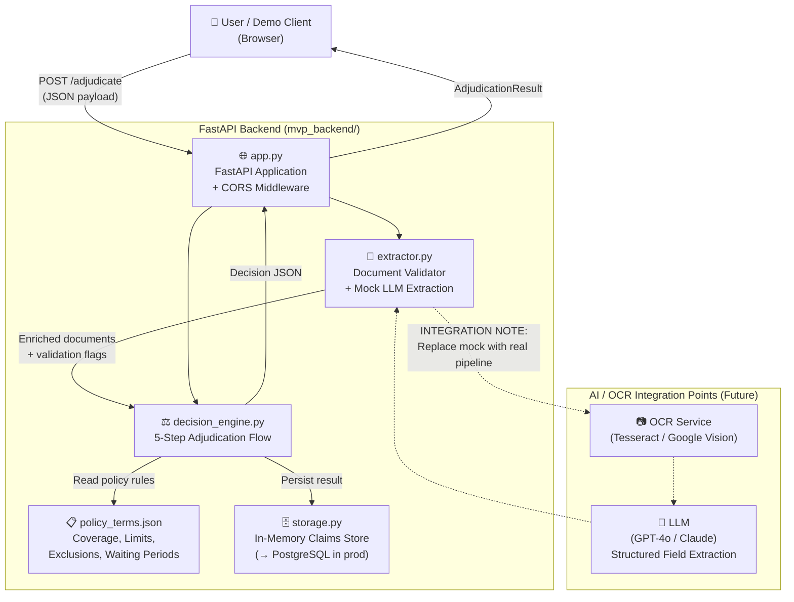

# Architecture Overview — Plum OPD Adjudication System

## System Summary

A full-stack web application that automates OPD insurance claim adjudication using a rule-based decision engine backed by a mock AI extraction layer. The system processes structured medical documents (bills, prescriptions), validates them against policy terms, and returns a structured approval/rejection decision with confidence scoring.

---

## High-Level Architecture



---

## Component Breakdown

### Frontend (`mvp_frontend/index.html`)
- **Technology**: Vanilla HTML/CSS/JavaScript (single file, zero dependencies)
- **Design**: Dark premium UI with Plum purple accent (`#6C47FF`), Google Fonts Inter
- **Features**:
  - 3-step guided claim form (Claim Info → Prescription → Bill Items)
  - Tag-based medicine/test input
  - Itemised bill builder with real-time total
  - 8 pre-loaded test case scenarios (TC001–TC010)
  - Live claims history panel
  - Animated decision result with confidence bar
  - Session stats dashboard
  - API health indicator

### API Layer (`mvp_backend/app.py`)
- **Technology**: FastAPI + Pydantic v2 + CORS middleware
- **Endpoints**:
  | Method | Endpoint | Description |
  |--------|----------|-------------|
  | GET | `/health` | Liveness probe + total claims count |
  | POST | `/adjudicate` | Submit and adjudicate a claim |
  | GET | `/claims` | List recent claims (paginated) |
  | GET | `/claims/{id}` | Get specific claim by ID |
  | GET | `/policy` | Read active policy summary |
  | GET | `/docs` | Interactive Swagger UI |

### Extractor (`mvp_backend/extractor.py`)
- **Current**: Mock validation layer
  - Validates doctor registration number format (`STATE/NUMBER/YEAR`, AYUSH variants)
  - Checks prescription completeness (required fields)
  - Checks bill has numeric line items
  - Returns extraction metadata with field-level confidence scores
- **Integration Path** (marked with `# INTEGRATION NOTE`):
  1. Receive document bytes (image/PDF)
  2. Run OCR → raw text
  3. Send text to LLM with structured extraction prompt → JSON fields
  4. Return `ExtractionResult` with confidence scores

### Decision Engine (`mvp_backend/decision_engine.py`)
- **Technology**: Pure Python rule engine
- **5-Step Flow**:
  ```
  Step 0: Minimum claim amount check (₹500)
  Step 1: Document validation (prescription present, doctor reg format)
  Step 2: Waiting period checks (initial 30d, diabetes 90d, hypertension 90d, joint 730d)
  Step 3: Pre-authorization check (MRI/CT > ₹10,000 requires pre-auth)
  Step 4: Diagnosis-level exclusion check (cosmetic, weight loss, HIV, etc.)
  Step 5: Itemised bill processing:
    → Map each item to coverage category
    → Apply sub-limits per category
    → Detect item-level exclusions
    → Per-claim limit enforcement
    → Fraud / manual review flags
    → Network discount (consultation portion only)
    → Co-pay calculation (consultation portion only)
  ```
- **Decision types**: `APPROVED`, `REJECTED`, `PARTIAL`, `MANUAL_REVIEW`

### Storage (`mvp_backend/storage.py`)
- **Current**: In-memory Python dict (session-scoped)
- **Production Path**: Replace with PostgreSQL via SQLAlchemy or Supabase client
- **Interface**: `save_claim()`, `get_claim()`, `list_claims()` — stable API, only implementation changes

### Models (`mvp_backend/models.py`)
- Pydantic v2 models for `ClaimRequest`, `ExtractionResult`, `AdjudicationResult`
- Input validation (date format, positive amounts)
- Self-documenting field descriptions for API spec generation

---

## Data Flow

```
User fills form
    → Frontend builds JSON payload
    → POST /adjudicate
    → extractor.py validates documents, returns enriched docs + metadata
    → decision_engine.py runs 5-step adjudication
    → storage.py persists claim + result
    → AdjudicationResult JSON returned
    → Frontend renders decision badge, confidence bar, breakdown
    → History panel updated
```

---

## Technology Decisions

| Choice | Rationale |
|--------|-----------|
| FastAPI | Auto-generates OpenAPI docs; async-ready; Pydantic integration |
| Pydantic v2 | Type safety, validation, serialization — critical for claim data integrity |
| Pure Python rule engine | Deterministic, auditable, easy to extend — suitable for regulated insurance domain |
| In-memory store | Zero-dependency MVP; same interface as DB for easy swap |
| Vanilla JS frontend | No build step — deployable as static file; reviewers can open directly |
| CORS wildcard (dev) | Allows static HTML to call local API; restrict in production |

---

## Scalability Path (Production)

```
Current MVP                    →    Production
─────────────────────────────────────────────────────────
In-memory dict                 →    PostgreSQL + SQLAlchemy
Mock extractor                 →    OCR (Google Vision) + GPT-4o
Rule engine                    →    Rule engine + LLM fallback + RAG
Single process uvicorn         →    Gunicorn + multiple workers
No auth                        →    JWT + role-based access
Static HTML                    →    React + TypeScript SPA
No monitoring                  →    Prometheus + Grafana
```

---

## Security Considerations (Production)
- Replace CORS wildcard with specific origins
- Add JWT authentication on all claim endpoints
- Rate limiting on `/adjudicate` (prevent abuse)
- Input sanitization (already handled by Pydantic validators)
- Audit log for all adjudication decisions (regulatory requirement)
- Encrypt PII (member name, diagnosis) at rest
